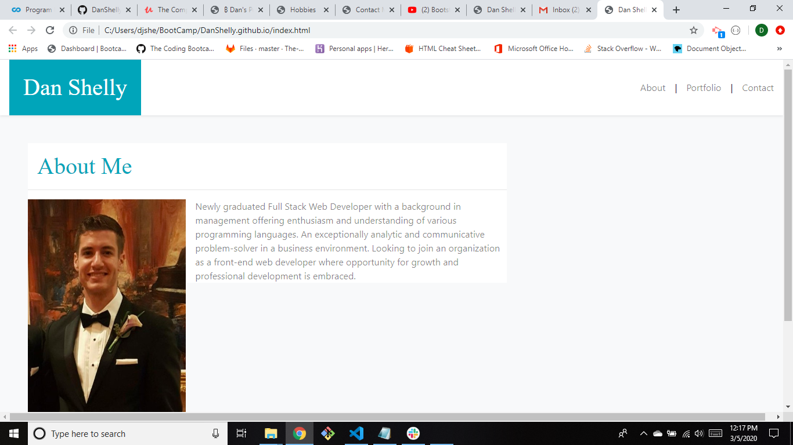

# Portfolio Website

## Description
This application is a website acting as my first portfolio that consists of a home page, a contact page, and a portfolio page.

## Functionality
The about me page displays a picture of myself as well as information about what I'm looking to do as a web developer. There is a header that includes navigation links to all 3 of the pages. The portfolio page includes links to my displayed projects from class, and the contact page includes a submission form that allows the user to contact me. This website is also mobile responsive.

## Screenshot

## Link
https://danshelly.github.io
