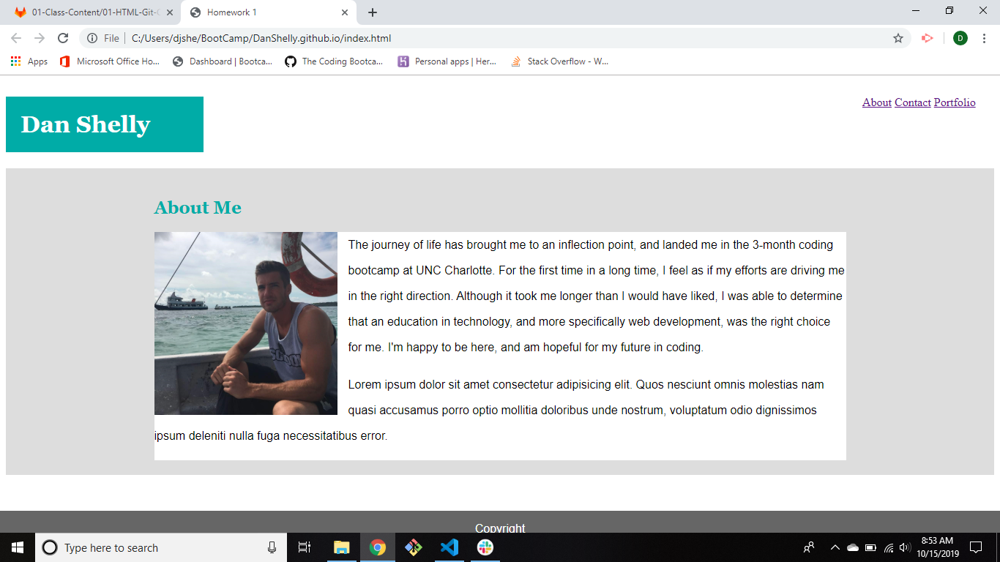
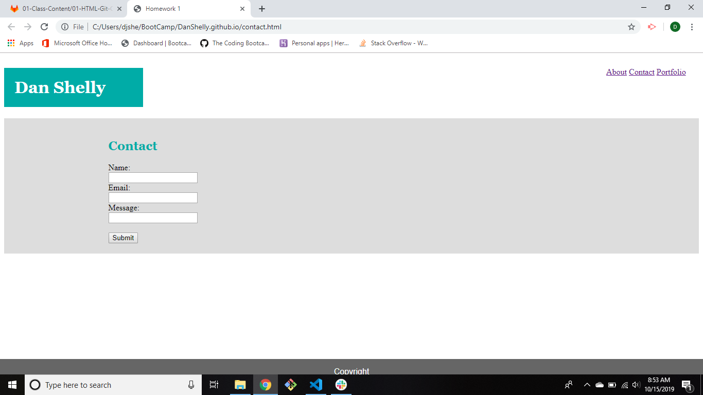
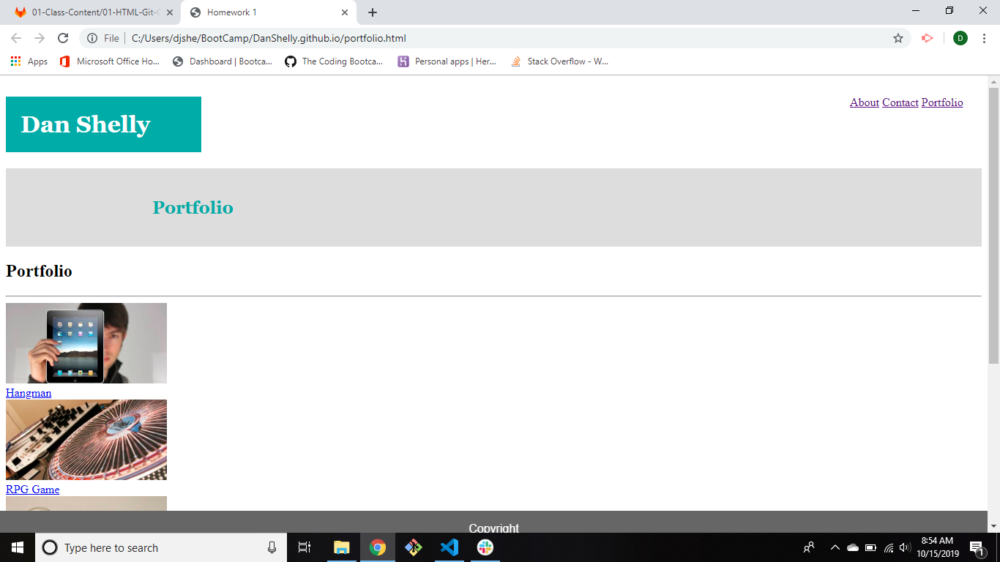

# DanShelly.github.io

# Homework 1

## Description

This program serves as a viewable portfolio for my work as a developer online. It currently contains an index page with a picture and short bio, a contact page where one can submit contact information, and a portfolio page showcasing work that I've done (future work).

## Usage

Click the links at the top right of the page to navigate between the three pages.

## Screenshots

